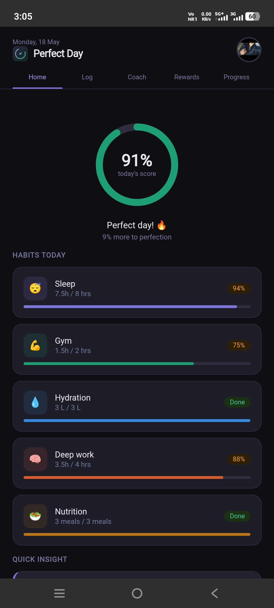
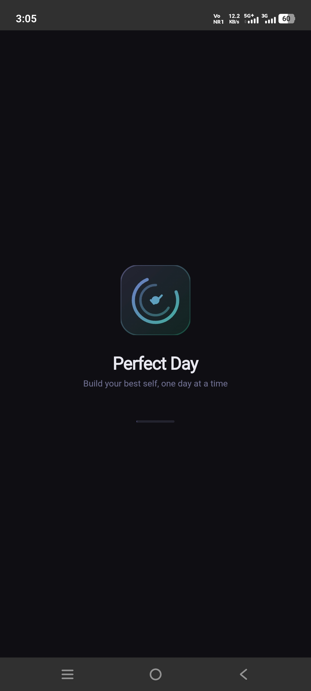
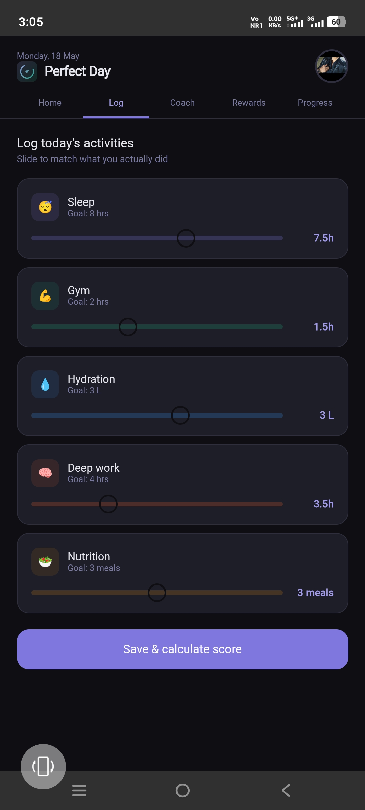
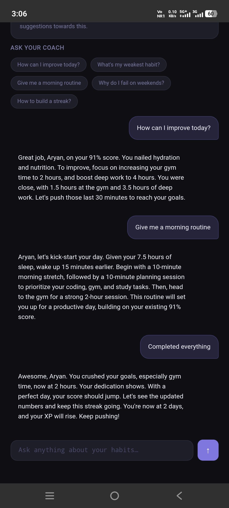
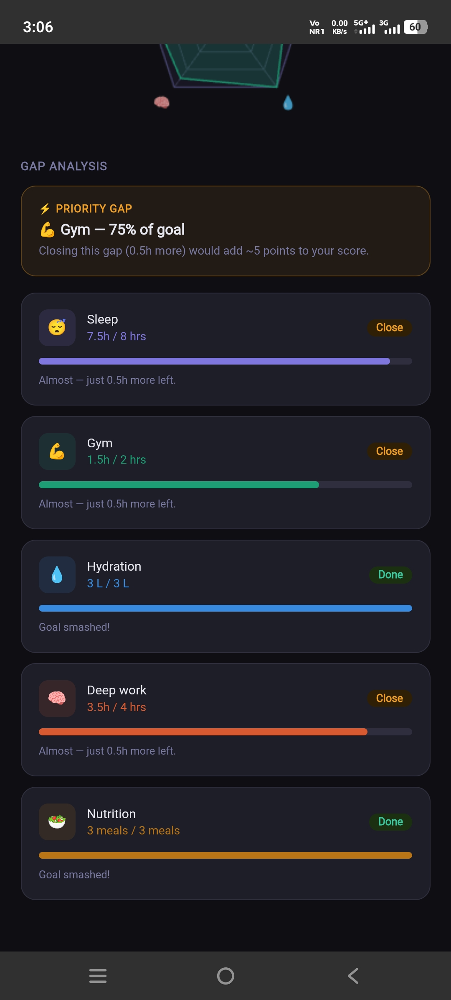
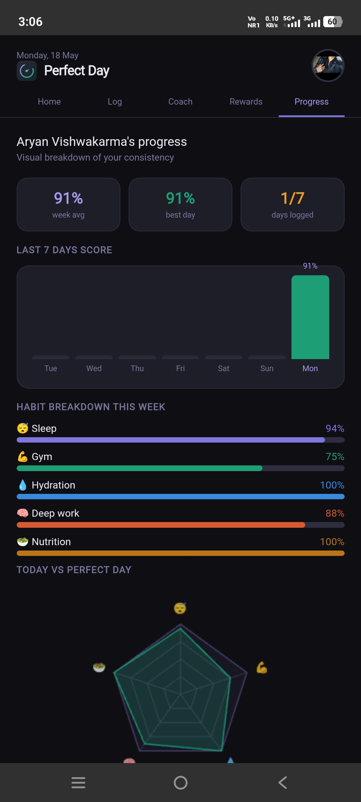
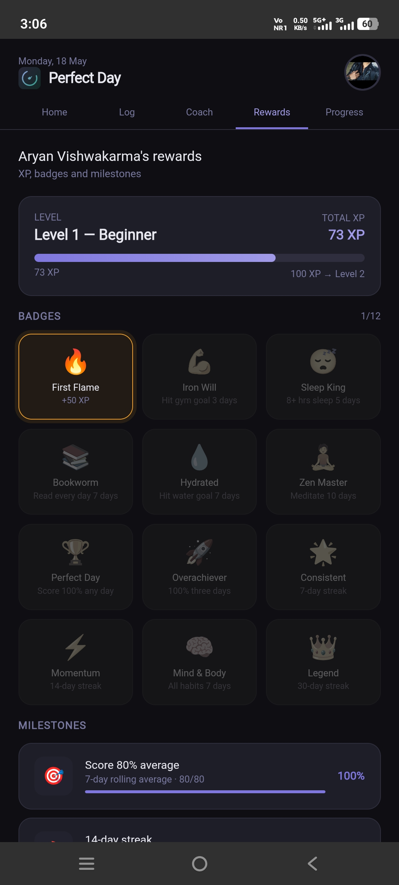
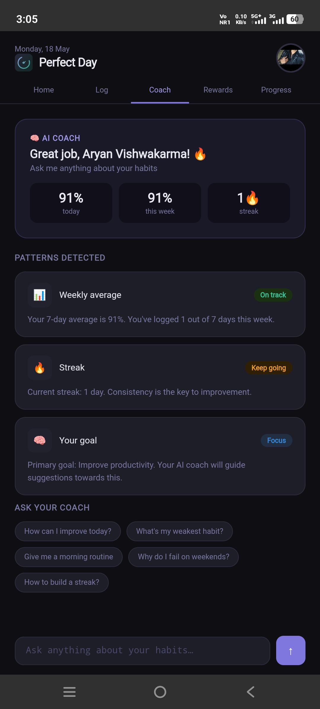

# 🌟 Perfect Day App

> A personalized AI-powered lifestyle tracking app that measures how close each day comes to your ideal — with habit tracking, AI coaching, gamification, and detailed progress analytics.



## 📱 Live Demo
🔗 **[Try it live](https://ArVishwakarma.github.io/perfect-day-app)**

---

## ✨ Features

- **Perfect Day Score** — Define your ideal day once, get a daily % score based on actual vs target habits
- **AI Life Coach** — Powered by Llama 3.3 (via Groq API) with a secure Cloudflare Worker proxy. Gives personalized advice based on your real habit data, age, profession, and goals
- **Habit Tracking** — Sleep, gym, hydration, reading, deep work, meditation, walking, nutrition
- **Gap Analysis** — Shows exactly how much you fell short per habit and what to prioritize
- **Gamification** — XP system, 12 unlockable badges, milestone tracker, weekly leaderboard
- **Progress Charts** — 7-day bar chart, radar chart (actual vs perfect day), weekly habit breakdown
- **Full Profile System** — Name, DOB, profession, city, goals, interests, custom avatar (emoji or photo upload)
- **6-Step Onboarding** — Guided setup that builds a personalized profile
- **Animated Splash Screen** — Logo fade-in on every launch
- **Persistent Storage** — All data saved in localStorage, survives app restarts
- **APK Ready** — Built with pure HTML/CSS/JS, wrappable with Capacitor for Android

---

## 📸 Screenshots

| Welcome | Home | Log Day |
|:---:|:---:|:---:|
|  |  |  |

| AI Coach | Profile | Progress |
|:---:|:---:|:---:|
|  |  |  |

| Rewards | Coach Chat |
|:---:|:---:|
|  |  |

---

## 🛠️ Tech Stack

| Layer | Technology |
|---|---|
| Frontend | HTML5, CSS3, Vanilla JavaScript |
| AI Model | Llama 3.3 70B via Groq API (free tier) |
| API Security | Cloudflare Workers — serverless proxy, no key exposed in code |
| Storage | localStorage (client-side persistence) |
| Charts | Canvas API (radar chart), CSS (bar chart) |
| Mobile Build | Capacitor (APK generation) |
| Hosting | GitHub Pages |

---

## 🏗️ Architecture

```
User App (index.html)
        │
        ▼
Cloudflare Worker (proxy)   ← API key stored here as secret env variable
        │
        ▼
Groq API — Llama 3.3 70B    ← AI responses generated here
```

> The API key is **never** in the app's source code. The Cloudflare Worker acts as a secure middle layer — a production-safe pattern required for public deployment.

---

## 📁 Project Structure

```
perfect-day-app/
├── index.html                 # Complete app — single file architecture
├── README.md                  # This file
├── assets/
│   └── logo.png               # App logo
├── screenshots/               # App screenshots for README
│   ├── welcome_screen.jpeg
│   ├── home.jpeg
│   ├── log.jpeg
│   ├── ai_coach.jpeg
│   ├── coach.jpeg
│   ├── profile.jpeg
│   ├── progress.jpeg
│   ├── rewards1.jpeg
│   └── rewards2.jpeg
└── cloudflare-worker/
    └── worker.js              # Secure Groq API proxy
```

---

## 🚀 Run Locally

```bash
# 1. Clone the repo
git clone https://github.com/ArVishwakarma/perfect-day-app.git

# 2. Open the app — no build step, no dependencies!
cd perfect-day-app
# Just open index.html in any browser
```

---

## ⚙️ Set Up AI Coach

1. Get a free Groq API key at [console.groq.com](https://console.groq.com)
2. Deploy `cloudflare-worker/worker.js` to [Cloudflare Workers](https://workers.cloudflare.com) (free)
3. Add `GROQ_KEY` as a secret environment variable in Worker settings
4. In `index.html`, replace this line:
```js
const PROXY_URL = 'https://YOUR-WORKER-NAME.workers.dev';
```
with your actual Worker URL.

---

## 📦 Build Android APK

```bash
npm install @capacitor/cli @capacitor/core @capacitor/android
npx cap init "Perfect Day" "com.yourname.perfectday"
npx cap add android
npx cap sync
npx cap open android
# Android Studio → Build → Generate Signed Bundle/APK
```

---

## 🔮 Roadmap

- [ ] Backend database (Supabase) for cross-device sync
- [ ] Push notifications for daily habit reminders
- [ ] Social features — share score, challenge friends
- [ ] iOS build via Capacitor
- [ ] Home screen widget showing daily score
- [ ] Light theme option

---

## 👤 Author

**Ar Vishwakarma**
- GitHub: [@ArVishwakarma](https://github.com/ArVishwakarma)

---

## 📄 License

MIT License — free to use, modify, and distribute.

---

⭐ **If you like this project, please star the repo — it helps a lot!**